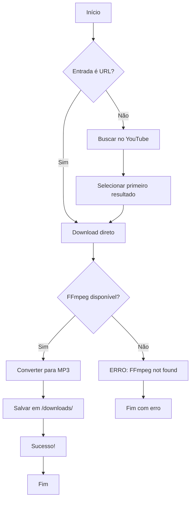

# Guia Completo: Script de Download de Músicas com yt-dlp

Este documento fornece um guia completo para criar um script funcional de download de músicas do YouTube usando a biblioteca `yt-dlp`. Qualquer IA que ler este documento será capaz de criar um script similar.

## 📋 Visão Geral

O script permite baixar músicas do YouTube em formato MP3 de duas formas:
1. **Por nome** - Busca automática no YouTube pelo nome da música
2. **Por link** - Download direto usando URL do YouTube

## 🔧 Pré-requisitos

### 1. Python
- **Versão recomendada**: Python 3.12 ou superior
- **Instalação no Windows** (via winget):
  ```powershell
  winget install Python.Python.3.12
  ```
- **Verificação**:
  ```powershell
  python --version
  ```

### 2. yt-dlp
- **Descrição**: Biblioteca Python para download de vídeos/áudio do YouTube
- **Instalação**:
  ```powershell
  python -m pip install yt-dlp
  ```

### 3. FFmpeg
- **Descrição**: Ferramenta necessária para converter áudio para MP3
- **Instalação no Windows** (via winget):
  ```powershell
  winget install Gyan.FFmpeg
  ```
- **Localização típica após instalação**:
  ```
  C:\Users\[Usuario]\AppData\Local\Microsoft\WinGet\Packages\Gyan.FFmpeg_Microsoft.Winget.Source_8wekyb3d8bbwe\ffmpeg-[versao]-full_build\bin
  ```

## 📝 Implementação do Script

### Estrutura Completa

```python
#!/usr/bin/env python3
"""
Script para baixar músicas do YouTube usando yt-dlp
Suporta download por link direto ou busca por nome da música
"""

import sys
import os
from pathlib import Path

try:
    import yt_dlp
except ImportError:
    print("Erro: yt-dlp não está instalado.")
    print("Instale usando: pip install yt-dlp")
    sys.exit(1)


def is_youtube_url(text):
    """Verifica se o texto é um link do YouTube"""
    youtube_domains = ['youtube.com', 'youtu.be', 'www.youtube.com']
    return any(domain in text for domain in youtube_domains)


def download_music(query, output_dir='downloads'):
    """
    Baixa música do YouTube em formato MP3
    
    Args:
        query: Link do YouTube ou nome da música para buscar
        output_dir: Diretório onde salvar o arquivo
    """
    # Criar diretório de downloads se não existir
    Path(output_dir).mkdir(exist_ok=True)
    
    # Configurações do yt-dlp
    ydl_opts = {
        'format': 'bestaudio/best',
        'postprocessors': [{
            'key': 'FFmpegExtractAudio',
            'preferredcodec': 'mp3',
            'preferredquality': '192',
        }],
        'outtmpl': f'{output_dir}/%(title)s.%(ext)s',
        'quiet': False,
        'no_warnings': False,
        'ffmpeg_location': r'C:\Users\Administrador\AppData\Local\Microsoft\WinGet\Packages\Gyan.FFmpeg_Microsoft.Winget.Source_8wekyb3d8bbwe\ffmpeg-8.0.1-full_build\bin',
    }
    
    # Se não for um link, adicionar ytsearch para buscar
    if not is_youtube_url(query):
        query = f'ytsearch1:{query}'
        print(f"Buscando por: {query}")
    else:
        print(f"Baixando do link: {query}")
    
    try:
        with yt_dlp.YoutubeDL(ydl_opts) as ydl:
            print("\nIniciando download...\n")
            info = ydl.extract_info(query, download=True)
            
            if 'entries' in info:
                # Caso seja uma busca
                video_info = info['entries'][0]
            else:
                video_info = info
            
            video_title = video_info.get('title', 'Unknown')
            print(f"\n[OK] Download concluido: {video_title}")
            print(f"[OK] Salvo em: {output_dir}/")
            return True
            
    except Exception as e:
        print(f"\n[X] Erro durante o download: {str(e)}")
        return False


def main():
    """Função principal"""
    print("=" * 60)
    print("    YOUTUBE MUSIC DOWNLOADER - yt-dlp")
    print("=" * 60)
    
    if len(sys.argv) > 1:
        # Se foi passado argumento na linha de comando
        query = ' '.join(sys.argv[1:])
    else:
        # Modo interativo
        print("\nVocê pode fornecer:")
        print("  1. Um link do YouTube")
        print("  2. O nome da música (ex: 'Believer Imagine Dragons')")
        print()
        query = input("Digite o link ou nome da música: ").strip()
    
    if not query:
        print("Erro: Nenhuma música foi especificada.")
        sys.exit(1)
    
    success = download_music(query)
    
    if success:
        print("\n" + "=" * 60)
        print("Download finalizado com sucesso!")
        print("=" * 60)
    else:
        print("\n" + "=" * 60)
        print("Falha no download.")
        print("=" * 60)
        sys.exit(1)


if __name__ == '__main__':
    main()
```

## 🔑 Pontos Críticos de Implementação

### 1. Configuração do FFmpeg
```python
'ffmpeg_location': r'C:\Users\[Usuario]\AppData\Local\Microsoft\WinGet\Packages\Gyan.FFmpeg_Microsoft.Winget.Source_8wekyb3d8bbwe\ffmpeg-[versao]-full_build\bin',
```
- **CRÍTICO**: Este caminho deve apontar para o diretório `/bin` do FFmpeg
- Para encontrar o caminho correto:
  ```powershell
  Get-ChildItem -Path "$env:LOCALAPPDATA" -Filter "ffmpeg.exe" -Recurse -ErrorAction SilentlyContinue | Select-Object -First 1 -ExpandProperty DirectoryName
  ```

### 2. Busca vs. Link Direto
```python
if not is_youtube_url(query):
    query = f'ytsearch1:{query}'  # Adiciona prefixo para busca
```
- **ytsearch1**: Busca e retorna o primeiro resultado
- **ytsearchN**: Retorna os N primeiros resultados

### 3. Opções do yt-dlp

| Opção | Descrição |
|-------|-----------|
| `format: 'bestaudio/best'` | Baixa a melhor qualidade de áudio disponível |
| `preferredcodec: 'mp3'` | Converte para formato MP3 |
| `preferredquality: '192'` | Define a qualidade do áudio em kbps |
| `outtmpl` | Template para o nome do arquivo de saída |
| `quiet: False` | Exibe informações durante o download |

### 4. Tratamento de Erros no Windows

**Problema comum**: Erro de encoding ao usar caracteres Unicode (✓, ✗) no console do Windows.

**Solução**: Use caracteres ASCII:
```python
print("[OK] Download concluido")  # ✓ Correto
print("✓ Download concluído")     # ✗ Causa erro no Windows
```

## 🚀 Uso do Script

### Modo 1: Linha de Comando
```powershell
# Por nome da música
python music_downloader.py "Believer Imagine Dragons"

# Por link do YouTube
python music_downloader.py "https://www.youtube.com/watch?v=VIDEO_ID"
```

### Modo 2: Interativo
```powershell
python music_downloader.py
# O script solicitará a entrada do usuário
```

## ⚠️ Problemas Comuns e Soluções

### 1. "FFmpeg not found"
**Causa**: yt-dlp não consegue localizar o FFmpeg.

**Solução**:
1. Verificar se FFmpeg está instalado
2. Adicionar o caminho correto em `ffmpeg_location`
3. Ou adicionar FFmpeg ao PATH do sistema

### 2. "Python não foi encontrado"
**Causa**: Python não instalado ou não está no PATH.

**Solução**:
1. Instalar Python via winget
2. Usar caminho completo: `C:\Users\[Usuario]\AppData\Local\Programs\Python\Python312\python.exe`

### 3. UnicodeEncodeError
**Causa**: Console do Windows não suporta caracteres Unicode.

**Solução**:
- Usar apenas caracteres ASCII em `print()`
- Evitar: ✓, ✗, emojis, etc.
- Usar: [OK], [X], [!], etc.

### 4. "yt-dlp not found"
**Causa**: Biblioteca não instalada.

**Solução**:
```powershell
python -m pip install yt-dlp
```

## 📊 Fluxo de Trabalho



## 🎯 Testes de Validação

### Teste 1: Busca por Nome
```powershell
python music_downloader.py "Believer Imagine Dragons"
```
**Resultado esperado**:
- Busca no YouTube por "Believer Imagine Dragons"
- Baixa o vídeo oficial "Imagine Dragons - Believer (Official Music Video)"
- Converte para MP3 (192 kbps)
- Salva em `downloads/Imagine Dragons - Believer (Official Music Video).mp3`

### Teste 2: Download por Link
```powershell
python music_downloader.py "https://www.youtube.com/watch?v=nq_BNXlBjVQ"
```
**Resultado esperado**:
- Download direto do vídeo especificado
- Conversão para MP3
- Arquivo salvo em `downloads/` com o título do vídeo

## 📝 Adaptações para Outros Sistemas

### Linux/macOS
```python
# Remover ou adaptar ffmpeg_location
'ffmpeg_location': '/usr/bin',  # ou deixar o yt-dlp detectar automaticamente

# Ou remover a linha completamente se FFmpeg estiver no PATH
```

### Instalação de dependências (Linux/macOS)
```bash
# Python e pip
sudo apt install python3 python3-pip  # Debian/Ubuntu
brew install python3                  # macOS

# FFmpeg
sudo apt install ffmpeg               # Debian/Ubuntu
brew install ffmpeg                   # macOS

# yt-dlp
pip3 install yt-dlp
```

## ✅ Checklist de Implementação

- [ ] Instalar Python (3.12+)
- [ ] Instalar yt-dlp via pip
- [ ] Instalar FFmpeg
- [ ] Localizar caminho do FFmpeg
- [ ] Criar script Python
- [ ] Configurar `ffmpeg_location` no script
- [ ] Usar caracteres ASCII em mensagens (Windows)
- [ ] Testar com busca por nome
- [ ] Testar com link direto
- [ ] Validar arquivos MP3 gerados

## 🎓 Conceitos Importantes

### yt-dlp vs youtube-dl
- **yt-dlp**: Fork mais atualizado e mantido ativamente
- **youtube-dl**: Projeto original, menos atualizações

### Formatos de Áudio
- **bestaudio**: Melhor qualidade de áudio disponível
- **best**: Melhor qualidade geral (vídeo + áudio)
- Preferir `bestaudio/best` para downloads de música

### Qualidade MP3
- **128 kbps**: Qualidade básica
- **192 kbps**: Qualidade boa (recomendado)
- **320 kbps**: Qualidade máxima

## 🔒 Considerações Legais

> **IMPORTANTE**: Este script é para uso educacional. Respeite os direitos autorais e os termos de serviço do YouTube. Baixe apenas conteúdo que você tem direito de acessar.

## 📚 Recursos Adicionais

- [Documentação oficial do yt-dlp](https://github.com/yt-dlp/yt-dlp)
- [Opções de formato](https://github.com/yt-dlp/yt-dlp#format-selection)
- [Post-processors](https://github.com/yt-dlp/yt-dlp#post-processing-options)
- [FFmpeg downloads](https://ffmpeg.org/download.html)

---

**Versão do documento**: 1.0  
**Última atualização**: Novembro 2025  
**Testado com**:
- Python 3.12.10
- yt-dlp 2025.11.12
- FFmpeg 8.0.1
- Windows 11
